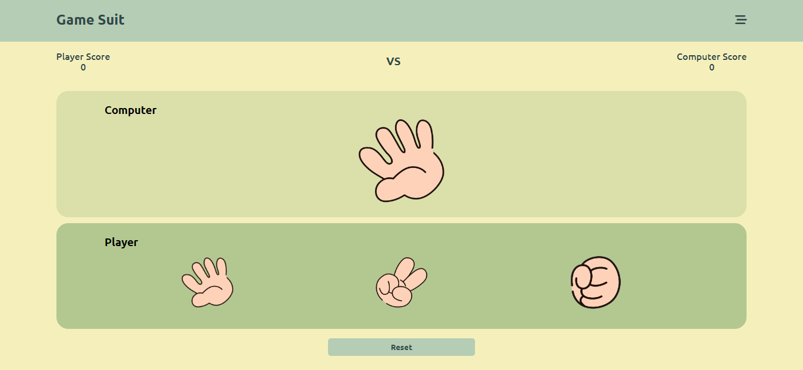

# rock-paper-scissors-Game
This is a simple web-based rock-paper-scissors game developed using HTML, CSS, and JavaScript. Players can play against the computer and keep track of their scores. The game interface is user-friendly and responsive.

Getting Started
To play the game, follow these steps:

Clone the repository to your local machine:
Copy code
git clone https://github.com/your-username/rock-paper-scissors-Game
.git
Open the index.html file in your preferred web browser.

Start playing the game by clicking on the images representing rock, paper, or scissors. The computer will randomly select its choice, and the result will be displayed on the screen.

The score will be updated based on the game's outcome: win, lose, or draw.

Features
Play rock-paper-scissors against the computer.
Keep track of the player's and computer's scores.
Reset the game to start a new match.
Technologies Used
HTML
CSS
JavaScript
Font Awesome (for icons)
Google Fonts (Ubuntu font)

Screenshots
Game Interface

License
This project is licensed under the MIT License.

Acknowledgments
The project was created as a fun learning exercise and is not intended for commercial use.

Enjoy the game!
